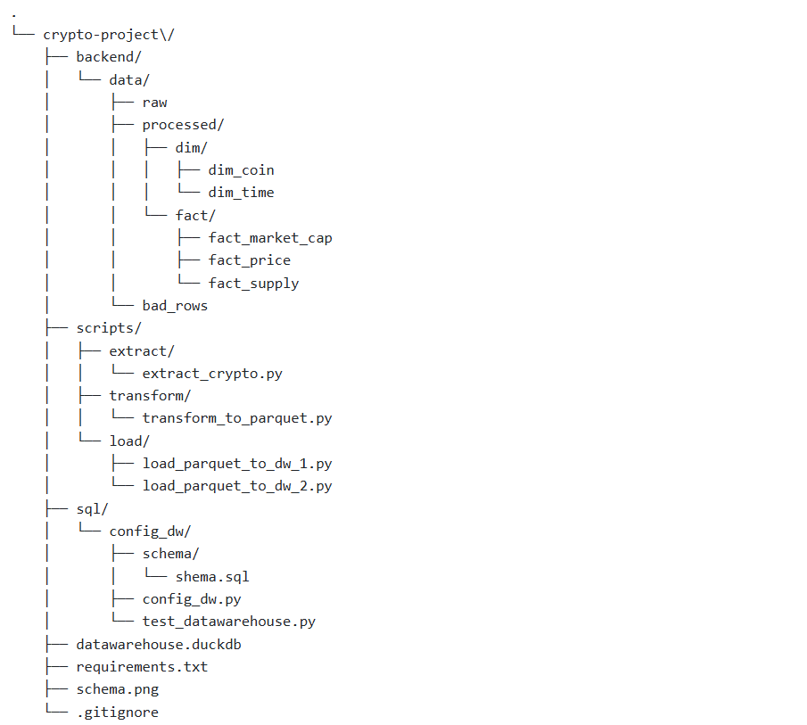

# Crypto ETL Pipeline

This project implements a full ETL pipeline to collect, process, and load cryptocurrency market data into a DuckDB data warehouse using Python, PySpark, and Apache Airflow.

## 📌 Features

- Extract daily crypto market data (from APIs like CoinGecko)
- Store raw JSON files in a `data/raw` directory
- Transform JSON data into structured dimension and fact tables
- Output clean data to Parquet files
- Load Parquet files into DuckDB with foreign key relationships
- Maintain data lineage with `coin_symbol` and `date`
- Support for error handling and bad row logging

## 🗂️ Project Structure



## 🚀 Setup

### Install Dependencies

```bash
pip install -r requirements.txt

# Extract
python scripts/extract/crawl_crypto.py

# Transform
python scripts/transform/transform_to_parquet.py

# Load DIM
python scripts/load/load_parquet_to_dw_1.py

# Load FACT
python scripts/load/load_parquet_to_dw_2.py

🧠 Technologies Used
Python 3.11

PySpark

DuckDB

Apache Airflow (for orchestration)

CoinGecko API

📅 Schedule (via Airflow)
DAGs are defined to run daily ETL jobs

Logs and configuration stored in project-local airflow/ directory

📬 Output
DuckDB file: datawarehouse.duckdb

Dimensions: dim_coin, dim_time

Facts: fact_price, fact_market_cap, fact_supply

🧹 Error Handling
Bad rows that cannot be joined to dimension tables are saved to backend/data/errors/

Format: bad_rows_<fact_table>_<YYYY_MM_DD>.parquet

🙌 Author
Tran Quoc Thang