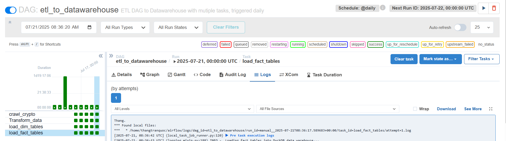

# 📄 Table Schema Change Log

This file tracks all changes to the data warehouse schema over time.

---

## ✅ Initial Schema (2025-07-15)

### DIMENSION TABLES

#### `dim_coin`
| Column Name  | Data Type | Description          |
|--------------|------------|----------------------|
| coin_id      | INTEGER    | Auto-incremented PK  |
| coin_symbol  | TEXT       | Symbol (e.g., BTC)   |
| coin_name    | TEXT       | Full coin name       |

#### `dim_time`
| Column Name  | Data Type | Description          |
|--------------|------------|----------------------|
| time_id      | INTEGER    | Auto-incremented PK  |
| date         | DATE       | Snapshot date        |
| year         | INTEGER    | Extracted from date  |
| month        | VARCHAR    | Month name           |
| quarter      | VARCHAR    | Quarter (Q1..Q4)     |
| day_of_week  | VARCHAR    | Name of weekday      |

---

### FACT TABLES

#### `fact_price`
| Column Name                | Description                          |
|---------------------------|--------------------------------------|
| coin_id             | FK to `dim_coin(coin_id)`            |
| time_id             | FK to `dim_time(time_id)`            |
| current_price             | Current trading price                |
| high_price_24h            | Highest price in past 24h            |
| low_price_24h             | Lowest price in past 24h             |
| price_change_24h          | Net change in price over 24h         |
| price_change_percentage_24h | Percentage change over 24h        |
| total_volume              | Total trading volume                 |

#### `fact_market_cap`
| Column Name                   | Description                        |
|------------------------------|------------------------------------|
| coin_id               | FK to `dim_coin(coin_id)`          |
| time_id               | FK to `dim_time(time_id)`          |
| market_cap                   | Market capitalization              |
| market_cap_rank              | Rank based on market cap           |
| market_fully_diluted_valuation | Fully diluted market valuation  |
| market_cap_change_24h        | Change in market cap in 24h        |
| market_cap_change_percentage_24h | Percentage change             |

#### `fact_supply`
| Column Name        | Description                                |
|--------------------|--------------------------------------------|
| coin_id     | FK to `dim_coin(coin_id)`                  |
| time_id     | FK to `dim_time(time_id)`                  |
| circulating_supply | Coins currently circulating                |
| total_supply       | Total coins created so far                 |
| max_supply         | Maximum possible coins                     |

---

## 🔄 Planned Changes

- Add `fact_ath_atl` table (tracking all-time high/low values)
- Add `dim_exchange` if exchange data is ingested

# 🧾 TABLE CHANGELOG — CRYPTO ETL PROJECT

This file records all schema changes and DAG-related updates in the data warehouse.

---

## 📅 Date: 2025-07-20
### 🔁 Affected DAG: `etl_to_datawarehouse`

### ✅ Tables Updated
#### 1. `dim_coin`
- **Change**: Added `UNIQUE(coin_symbol, coin_name)`
- **Reason**: To prevent duplicate coin info due to inconsistent API results
- **DAG Impact**: DAG task `load_dim_coin` now checks for existing entries before insert.

#### 2. `dim_time`
- **Change**: Added `UNIQUE(date)`
- **Reason**: Time dimension was producing duplicate rows on each DAG run.
- **DAG Impact**: `load_dim_time` will now use `MERGE`-like logic to upsert.

#### 3. `fact_price`
- **Change**: Added `FOREIGN KEY (coin_id) → dim_coin`, `FOREIGN KEY (time_id) → dim_time`
- **Reason**: Ensure referential integrity between dim and fact
- **DAG Impact**: `transform_price_task` will only process data if dim data exists.

---

## 📅 Date: 2025-07-16
### 🧱 New Tables Created
#### 1. `fact_market_cap`
- Columns: `coin_id`, `time_id`, `market_cap`, `market_cap_rank`, ...
- Linked to: `dim_coin`, `dim_time`

#### 2. `fact_supply`
- Columns: `coin_id`, `time_id`, `circulating_supply`, `max_supply`, ...
- Linked to: `dim_coin`, `dim_time`

---

## ⚠️ DAG & Validation Notes
- All DAGs now include a **data quality check** step to verify:
  - No NULL values in `coin_id` / `time_id` in fact tables
  - No duplicates in `dim_coin`, `dim_time`
- Added a DAG sensor to wait for latest Parquet before loading fact tables.

## 🗂️ Check Airflow schedule

